# 02 — Architecture

All diagrams are Mermaid. GitHub renders them. An agent reads the source
directly.

## 1. System context

Who talks to what.

<picture>
  <source media="(prefers-color-scheme: dark)" srcset="diagrams/02-architecture-1-dark.svg">
  
</picture>

Diagram source (Mermaid)

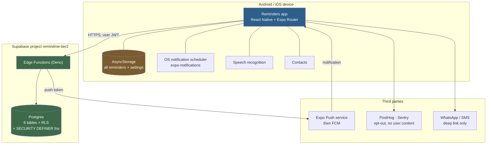

**Read this first:** the app never calls Postgres or PostREST directly. Every
backend call goes through an Edge Function. That is [ADR 0001](../adr/0001-client-talks-to-edge-functions-not-postgrest.md).

## 2. Monorepo layout

<picture>
  <source media="(prefers-color-scheme: dark)" srcset="diagrams/02-architecture-2-dark.svg">
  
</picture>

Diagram source (Mermaid)

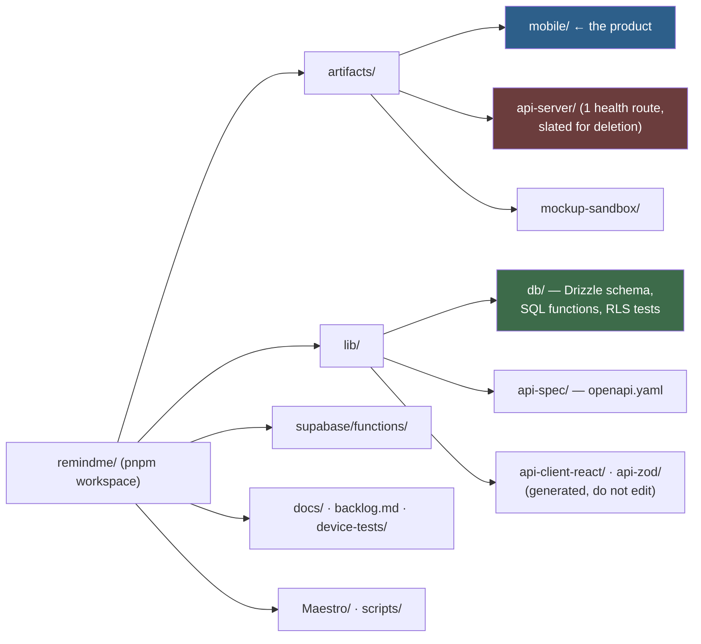

`artifacts/api-server`, `lib/api-spec`, `lib/api-client-react` and
`lib/api-zod` are a working pipeline with nothing flowing through it. Do not
assume the mobile app uses them. It does not.

## 3. Mobile layers

The rule: **screens never touch storage or the OS. Services do.**

<picture>
  <source media="(prefers-color-scheme: dark)" srcset="diagrams/02-architecture-3-dark.svg">
  
</picture>

Diagram source (Mermaid)

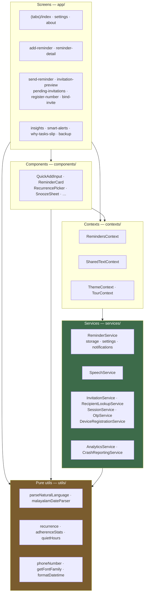

Layer rules, in order of importance:

1. `ReminderService.ts` is the **only** module that reads or writes
   AsyncStorage and the only one that calls `expo-notifications`.
2. Screens call `useReminders()`. Screens do not import `ReminderService`.
3. `utils/` is pure. No storage, no network, no React. This is why the
   parsers and statistics have heavy test coverage.

## 4. Provider tree

The nesting order is load-bearing. Getting it wrong throws at render time.

<picture>
  <source media="(prefers-color-scheme: dark)" srcset="diagrams/02-architecture-4-dark.svg">
  
</picture>

Diagram source (Mermaid)

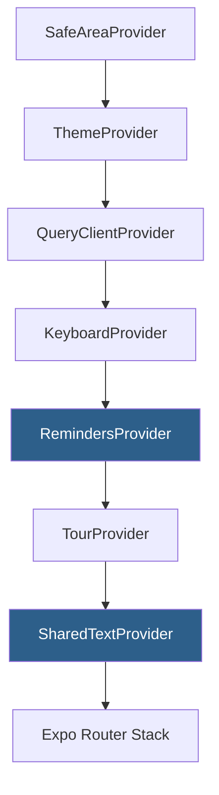

`SharedTextProvider` reads settings through `useReminders()`. It must sit
**inside** `RemindersProvider`. This exact mistake has broken three test
files. Copy the order above into any test that renders both.

## 5. Backend

<picture>
  <source media="(prefers-color-scheme: dark)" srcset="diagrams/02-architecture-5-dark.svg">
  
</picture>

Diagram source (Mermaid)

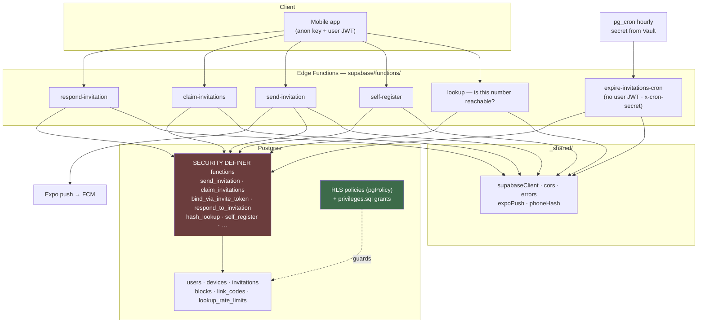

Three facts that catch people:

- **A new table with no `pgPolicy` has RLS off.** Drizzle enables RLS only on
  tables that declare a policy. A test asserts `tablesWithoutRls()` is empty.
- **`drizzle-kit push` does not apply functions or grants.** `push:sql` is a
  second, required step. Run both, every time.
- **`SECURITY DEFINER` functions bypass RLS.** That is deliberate. They take
  no argument the caller can lie about, pin `search_path`, schema-qualify
  every name, and revoke from `public`, `anon` **and** `authenticated` by
  name.

## 6. Data model on the device

One `Reminder` record carries everything. There is no second table.

<picture>
  <source media="(prefers-color-scheme: dark)" srcset="diagrams/02-architecture-6-dark.svg">
  
</picture>

Diagram source (Mermaid)

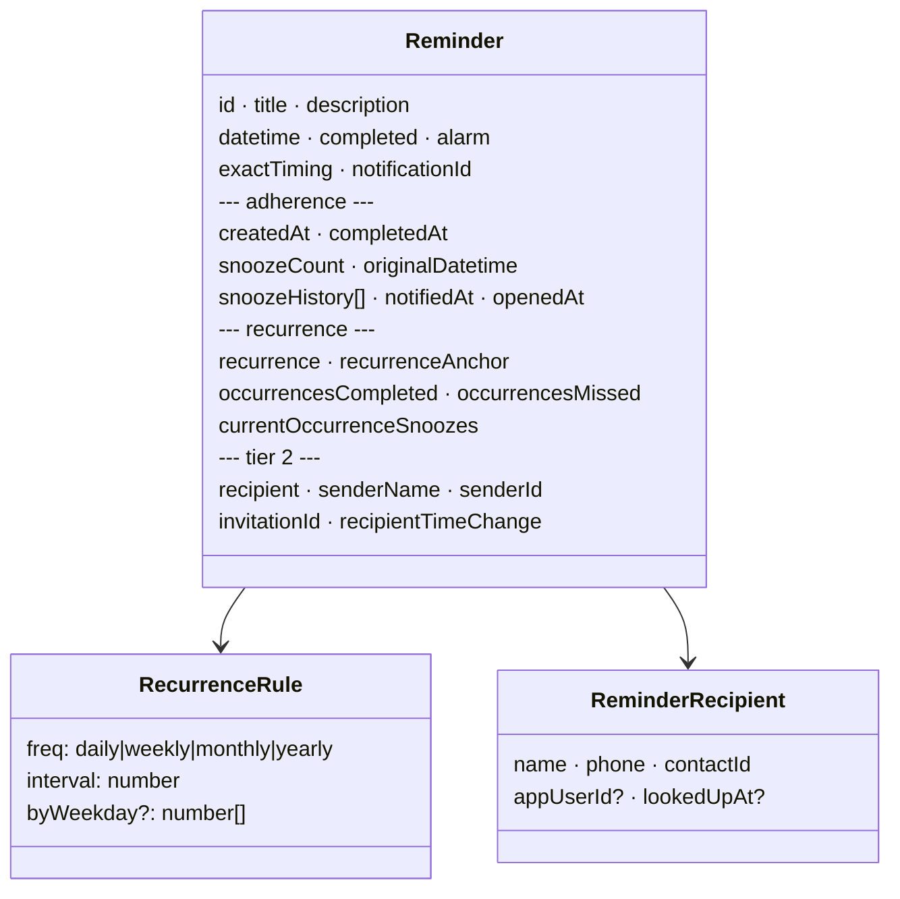

Three fields hold three different times. Do not mix them:

| Field | Meaning | Who moves it |
| --- | --- | --- |
| `datetime` | When this occurrence fires now. | A snooze, an edit, an advance. |
| `originalDatetime` | The first time it ever had. | Set once, on first snooze. |
| `recurrenceAnchor` | What "every day at 8" means. | A deliberate time edit only. **Never a snooze.** |

Statistics bucket by `originalDatetime ?? datetime`. Recurrence computes from
`recurrenceAnchor`. Both rules exist because a snooze overwrites `datetime`.
