# 04 — Key flows

Six flows cover most of the app. Each one names the files it passes through.

## 1. Create a reminder from a sentence

<picture>
  <source media="(prefers-color-scheme: dark)" srcset="diagrams/04-key-flows-1-dark.svg">
  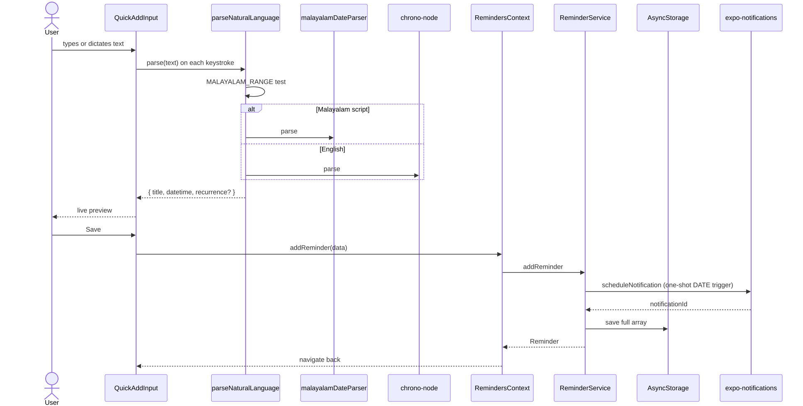
</picture>

Diagram source (Mermaid)

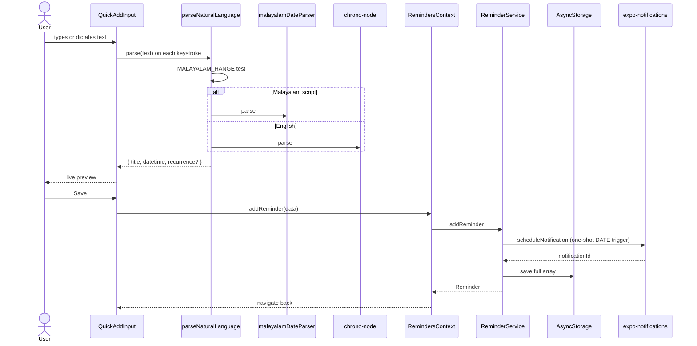

Notes:
- The parser runs on **every keystroke**. This is why the `nl_parse_result`
  analytics event fires at save, not at parse.
- The channel is chosen by `channelIdForAlarm(alarm, vibrate)`.
- `exactTiming` decides whether the trigger is alarm-clock backed.

## 2. A notification fires and the user acts

<picture>
  <source media="(prefers-color-scheme: dark)" srcset="diagrams/04-key-flows-2-dark.svg">
  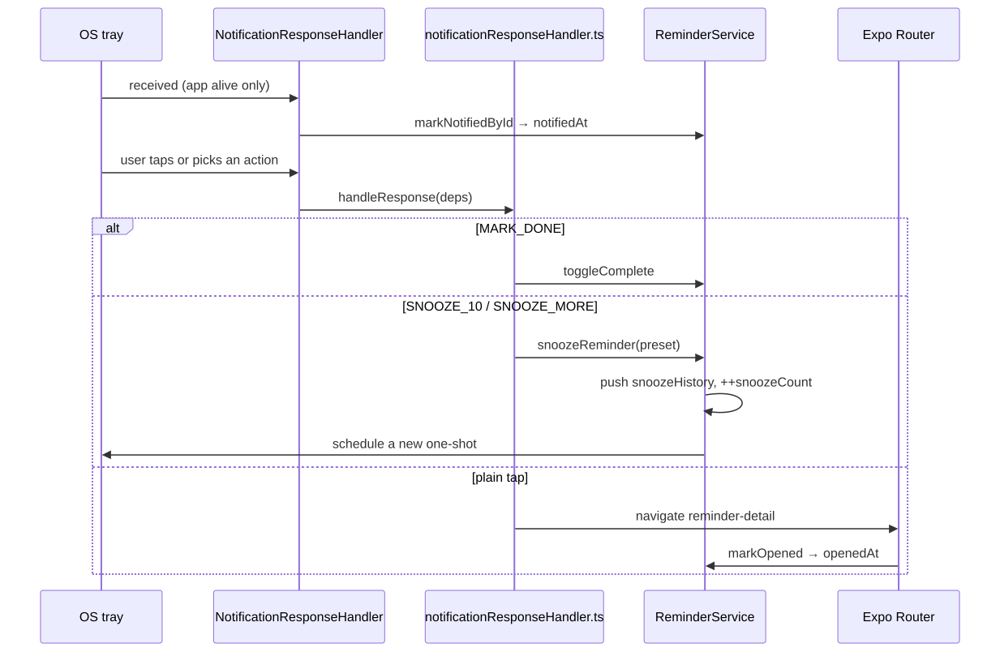
</picture>

Diagram source (Mermaid)

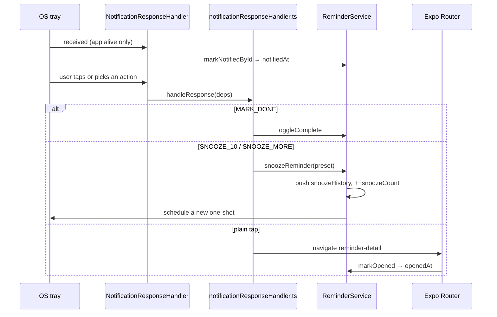

Important limit: `addNotificationReceivedListener` only fires while the app
process is alive. A notification delivered to a killed app's tray leaves no
`notifiedAt`. This stamp is evidence a notification fired. It is not proof it
was the only time.

## 3. A recurring series moves forward

<picture>
  <source media="(prefers-color-scheme: dark)" srcset="diagrams/04-key-flows-3-dark.svg">
  
</picture>

Diagram source (Mermaid)

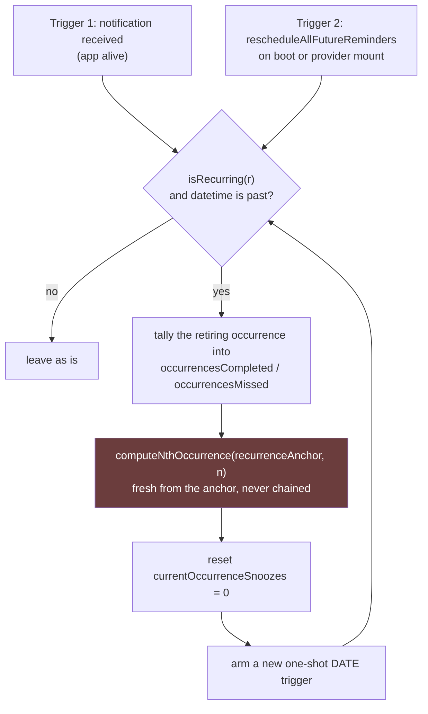

Two rules the tests pin:

1. **Compute every candidate fresh from `recurrenceAnchor`.** Chaining
   forward compounds the day-of-month clamp. Jan 31 caught up three months
   by chaining lands on Apr 28. The correct answer is Apr 30.
2. **Never compute from `datetime`.** A snooze has moved it.

The boot sweep is what covers a killed app. It catches up several missed
occurrences in one pass.

## 4. Intake from another app

<picture>
  <source media="(prefers-color-scheme: dark)" srcset="diagrams/04-key-flows-4-dark.svg">
  
</picture>

Diagram source (Mermaid)

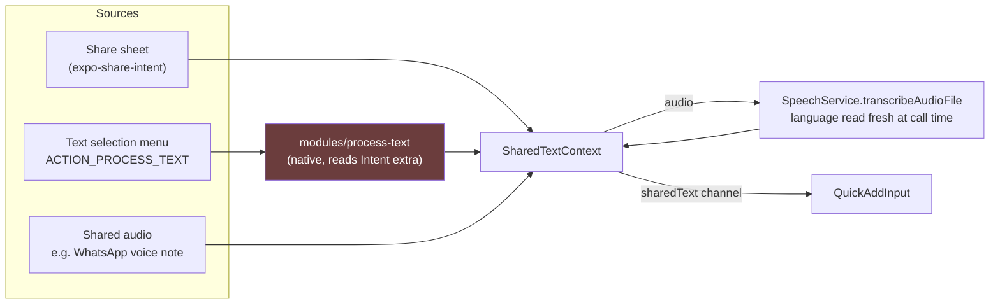

Why a native module: the selected text arrives as an Intent **extra**. React
Native's Linking API cannot read an extra. The module consumes the intent
after reading it, so a rotation does not re-insert handled text.

Why the language is read fresh from `ReminderService.getDictationLanguage()`
and not from a prop: a cold start would otherwise use a stale closure.

## 5. Remind someone else — Tier 1

<picture>
  <source media="(prefers-color-scheme: dark)" srcset="diagrams/04-key-flows-5-dark.svg">
  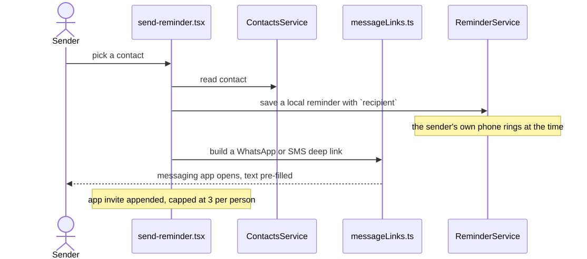
</picture>

Diagram source (Mermaid)

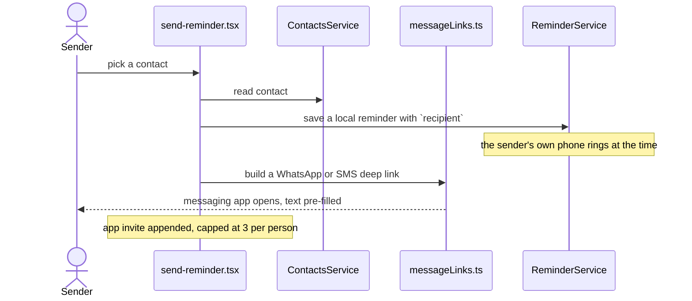

No backend. No account. This tier works offline apart from the message.

## 6. Remind someone else — Tier 2 (app to app)

<picture>
  <source media="(prefers-color-scheme: dark)" srcset="diagrams/04-key-flows-6-dark.svg">
  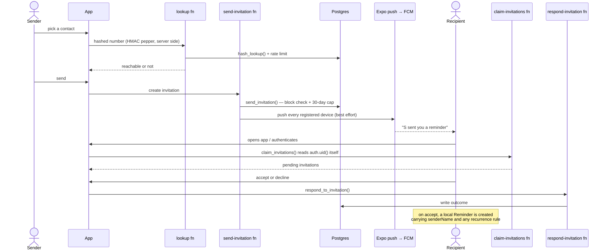
</picture>

Diagram source (Mermaid)

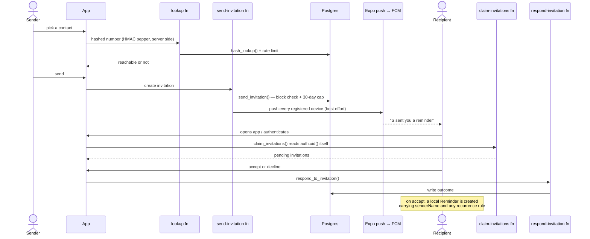

Facts worth holding:

- A missing or dead push token never fails the send. The recipient still
  collects the invitation on next auth through `claim-invitations`.
- `claim_invitations()` accepts **no** caller-supplied identity. It reads
  `auth.uid()`'s own row.
- `invitations.bind_token` is the verification credential. Possessing the
  link is the proof. Consumption is tracked on `bound_by` / `bound_at`, not
  inferred from `users.phone_hash` — an account is deletable, so a proxy
  inferred from it dies with the account.
- `PHONE_HASH_PEPPER` **must never be rotated.** Every stored `phone_hash`
  depends on it. Rotation breaks all matching silently, with no error.
- `expire-invitations-cron` runs hourly through `pg_cron` + `pg_net`, with
  its secret pulled from Supabase Vault, not embedded in the job SQL.

## 7. Where statistics come from

<picture>
  <source media="(prefers-color-scheme: dark)" srcset="diagrams/04-key-flows-7-dark.svg">
  
</picture>

Diagram source (Mermaid)

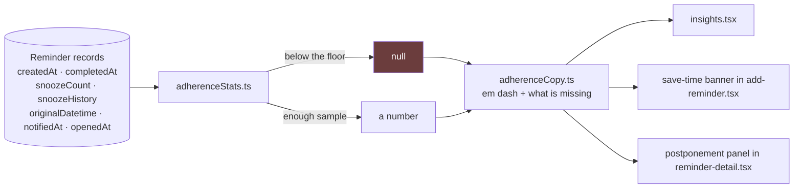

There is **no event log**, deliberately. Accepted costs: a notification the
user swiped away is invisible, and deleting a reminder deletes its history.

`suggestBetterHour()` stays silent unless it has evidence **against** the
hour the user picked. Absence of data is not an argument for moving somebody's
reminder.
