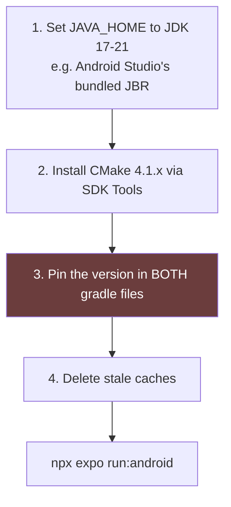

# 05 — Local development

Canonical run and operate rules live in [`CLAUDE.md`](../../CLAUDE.md). This
page is the working copy: the commands you use every day, in order.

## Prerequisites

| Need | Note |
| --- | --- |
| `pnpm` | **Only pnpm.** The root `preinstall` hook rejects npm and yarn. |
| Node | As the workspace requires. |
| Android Studio | For a local native build or an emulator. |
| JDK 17–21 | `JAVA_HOME` must point at it. See the Windows section. |

Install:

```bash
pnpm install
```

`pnpm-workspace.yaml` sets `minimumReleaseAge: 1440`. A package must be one
day old before it installs. **Do not disable this.** To allow one trusted
package, add it to `minimumReleaseAgeExclude`.

## The commands you run most

```bash
# Typecheck everything. Run this before every commit.
pnpm run typecheck

# Typecheck only lib/. Faster, for lib changes.
pnpm run typecheck:libs

# Mobile tests
pnpm --filter @workspace/mobile run test
pnpm --filter @workspace/mobile run test:watch
pnpm --filter @workspace/mobile run test:coverage

# One test file
cd artifacts/mobile && npx jest <pattern>

# Database and RLS tests (real Postgres through PGlite, no Docker)
pnpm --filter @workspace/db run test
```

**The completion gate:** the full mobile suite **and** `pnpm run typecheck`
must pass before you report any task done. A failing test blocks completion
even when it fails for an unrelated reason. Fix it in the same session and
say that the fix is unrelated.

Two failure shapes recur here:

1. **A hardcoded absolute date used as a fixture.** It quietly becomes "today"
   or "the past" as real time passes. Compute fixture dates from `new Date()`
   at run time.
2. **A hardcoded UTC assumption.** A test asserting an exact ISO string for a
   value computed with local-time APIs passes only on a UTC machine. Compute
   the expected value with the same helper the production code uses.

## Running the app

### Fastest: JavaScript only, no native build

```bash
cd artifacts/mobile
npx expo start      # then press 'a'
```

This serves JavaScript to an already-installed dev client through Metro. It
cannot add a native module, a permission, or an intent filter.

### Full local native build (no EAS quota)

```bash
cd artifacts/mobile
npx expo run:android
# target one device by serial:
ANDROID_SERIAL=<serial> npx expo run:android
```

`--device` wants the interactive picker **label**, not an adb serial. Use
`ANDROID_SERIAL` for a serial.

### EAS builds

```bash
pnpm --filter @workspace/mobile run build:android        # preview
pnpm --filter @workspace/mobile run build:android:prod   # production
pnpm --filter @workspace/mobile run build:android:dev    # dev client
```

From a machine that is not Replit, set a token first:

```bash
export EXPO_TOKEN=<token from expo.dev → Settings → Access Tokens>
cd artifacts/mobile
npx eas-cli build --platform android --profile preview --non-interactive
```

CI: `.github/workflows/eas-build.yml` is manual (`workflow_dispatch`). It runs
typecheck and test first, then `eas build`. It needs an `EXPO_TOKEN` secret.

## Device workflow (Android)

| Step | Command or rule |
| --- | --- |
| Metro port | **3011** in this repo. |
| After any reconnect | `adb reverse tcp:3011 tcp:3011` |
| Which client | The **dev client**, never Expo Go. |
| Device shows `unauthorized`/`offline` | Stop. Ask the user to re-approve. Retries do not answer a prompt. |
| Finding elements | `adb shell uiautomator dump`, or Maestro selectors. Do not guess tap coordinates. |
| One wrapper for all of it | `scripts/dev-device.ps1` |

**A stuck splash screen with no crash in logcat is almost always the missing
`adb reverse`, not a code bug.**

## End-to-end tests (Maestro)

```bash
maestro test Maestro/<file>.yaml
```

Rules:
- Use the Maestro CLI. Never raw `adb` or `uiautomator` for a flow.
- Select by `id:` (the component's `testID`) wherever one exists. Text
  selectors break on copy changes and on Malayalam font rendering.
- Keep each flow short and single-purpose. Assert on specific strings.
- Default to non-destructive flows. Use `clearState: true` only when the test
  needs a known-empty list.

**`inputText` cannot type Malayalam on Android.** Maestro drives text entry
through `adb shell input text`, which is ASCII only. Asserting on Malayalam
already on screen works fine. Only typing it is blocked. The workaround is
`run-malayalam-maestro-flow.ps1`, which sequences two Maestro flows around an
ADBKeyboard broadcast. It needs ADBKeyboard pre-installed on that device.

This limit does **not** apply to Jest. React Native Testing Library's
`fireEvent.changeText` never touches adb, so the Malayalam parser tests type
Malayalam freely.

## Local Android builds on Windows

Four things must all be right, or the build fails in ways that look unrelated.
Do them in this order.



1. **`JAVA_HOME`.** A newer system JDK gives
   `Error resolving plugin [id: 'com.facebook.react.settings'] > 26.0.2`.
   That "26.0.2" is your Java version, mis-parsed. Point `JAVA_HOME` at
   `C:\Program Files\Android\Android Studio\jbr` (JDK 21).

2. **CMake.** AGP's default 3.22.1 bundles Ninja 1.10, which has a real
   Windows long-path bug. Windows' own `LongPathsEnabled` does not fix it —
   the 260-character check is internal to Ninja. Symptom:
   `Filename longer than 260 characters`, or
   `manifest 'build.ninja' still dirty after 100 tries`.

3. **Pin CMake in two places. The `:app` pin alone is not enough.**
   Modules under `node_modules` carry their own `externalNativeBuild` block
   and ignore both the `:app` pin and the `CMAKE_VERSION` environment
   variable.

   `artifacts/mobile/android/app/build.gradle`:
   ```gradle
   android {
     externalNativeBuild { cmake { version "4.1.2" } }
   }
   ```

   `artifacts/mobile/android/build.gradle`, after `allprojects`:
   ```gradle
   subprojects {
     afterEvaluate { project ->
       if (project.hasProperty("android")) {
         def androidExt = project.android
         if (androidExt.hasProperty("externalNativeBuild")) {
           androidExt.externalNativeBuild { cmake { version "4.1.2" } }
         }
       }
     }
   }
   ```

   `android/` is prebuild-generated. **Reapply both edits after every
   `expo prebuild --clean`.**

4. **Delete stale caches** after a CMake change: `android/app/.cxx`,
   `android/app/build`, `android/build`, `android/.gradle`.

## Backend work

```bash
# Push the Drizzle schema (needs DATABASE_URL)
pnpm --filter @workspace/db run push

# Then the functions and grants. drizzle-kit push does NOT manage these.
pnpm --filter @workspace/db run push:sql
```

**Both commands, every time.** They have drifted apart before, and a whole
table has been missing from the live database while looking correct in the
schema source.

Deploy one Edge Function:

```powershell
$env:SUPABASE_ACCESS_TOKEN = '<token>'
.\scripts\deploy-edge-functions.ps1 -Function <name>
```

Without a token or CLI, use the `mcp__Supabase__deploy_edge_function` tool and
inline each function's `_shared/*.ts` dependencies into the `files` array. No
import map is needed; all other dependencies are `esm.sh` URL imports.

## Codegen

```bash
pnpm --filter @workspace/api-spec run codegen
```

Edit `lib/api-spec/openapi.yaml` only. Never edit anything inside a
`generated/` directory. The OpenAPI `info.title` **must stay "Api"** — import
paths break if it changes.

## Environment variables

| Variable | Needed for |
| --- | --- |
| `DATABASE_URL` | `db run push`, `push:sql`, api-server |
| `SUPABASE_ACCESS_TOKEN` | Edge Function deploys only |
| `EXPO_TOKEN` | EAS builds outside Replit |
| `EXPO_PUBLIC_SUPABASE_URL` / `_ANON_KEY` | Optional override. The client already hardcodes the live project. |
| `PHONE_HASH_PEPPER`, `CRON_SECRET` | Set as Edge Function secrets in the dashboard. Never in the repo. |

## Known rough edges

- expo.dev's GitHub App integration fails with `ERR_PNPM_NO_LOCKFILE` when the
  base directory is `artifacts/mobile`. The lockfile lives at the repo root.
  Build from the CLI instead.
- `react` and `react-dom` are pinned to exactly `19.1.0`. Do not bump without
  checking Expo SDK compatibility.
- Android speech recognition downloads a per-locale offline model on first
  use. Expect a "Preparing voice recognition" state.
- `jest.config.js` relies on the `jest-expo` preset's `transformIgnorePatterns`.
  Do not override it with a flat `node_modules` pattern; that breaks under
  pnpm's `.pnpm` store layout.
