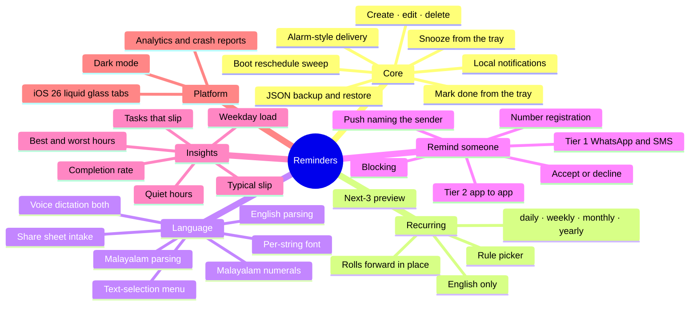
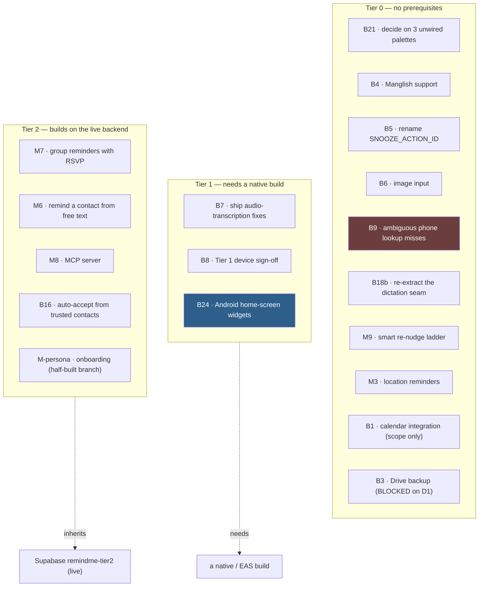

# 06 — Features and plans

**This page is a summary. It is not the source of truth.**

| Question | Authoritative file |
| --- | --- |
| What can the app do today, and how well is it proven? | [`docs/features.md`](../features.md) |
| What is still open? | [`backlog.md`](../../backlog.md) |
| What landed, and how do I announce it? | [`docs/shipped.md`](../shipped.md) |
| Why is a feature designed this way? | [`docs/roadmap.md`](../roadmap.md) |
| What is unproven on hardware? | [`device-tests/`](../../device-tests/) |

## Proof levels

Every capability carries a proof level. Read it before you claim anything
works.

| Level | Meaning |
| --- | --- |
| `device` | A human watched it work on real hardware. Logged in `device-tests/`. |
| `live` | Confirmed end to end against the deployed backend. |
| `jest` | Green in the suite. **Never run on a device.** Not evidence it works. |

Jest runs in jsdom. There is no viewport, no keyboard, no system chrome, no
notification tray, and no OEM power manager. Anything that fails as
"off-screen", "behind something", "never fired", or "wrong colour on a real
background" cannot be caught by the suite.

**Never mark an item `PASS` yourself.** A pass comes from a human who watched
it happen.

## Supported today — by area

<picture>
  <source media="(prefers-color-scheme: dark)" srcset="diagrams/06-features-1-dark.svg">
  
</picture>

Diagram source (Mermaid)

Full table with file paths and proof levels: [`docs/features.md`](../features.md).

## Deliberately absent

These are choices, not gaps.

- **No account for core reminders.** Tier 2 registration is optional and skippable.
- **No event log.** Statistics are derived from the reminder records.
- **No booking integration** (M7) and **no ride-request API** (M5). Deep links only.
- **No repeating OS trigger.** One-shot triggers only.

## Planned — the shape of the backlog

<picture>
  <source media="(prefers-color-scheme: dark)" srcset="diagrams/06-features-2-dark.svg">
  
</picture>

Diagram source (Mermaid)

Effort: S = hours. M = a day or more. L = needs its own spec, or touches
architecture, or needs a native build or backend.

Statuses in use: `OPEN`, `IN PROGRESS`, `BLOCKED`, `PARTIAL`, `DEFERRED`.

Read [`backlog.md`](../../backlog.md) for the notes on each item. They carry
the real reasoning, including the two items that are most likely to bite:

- **B9** — an ambiguous phone number silently misses. The user sees a bare
  "not reachable" badge, which looks the same as the recipient not having the
  app. Workaround: type the number with a leading `+` and country code.
- **B24** — widgets need native Android code. React Native cannot render a
  widget, and the widget process cannot read AsyncStorage.

## The work-tracking rule

Four files, one genre each. **Do not fold them together, and do not add a
fifth.**

When an item ships:
1. Delete its row from `backlog.md`.
2. Add an entry to `docs/shipped.md`, **in the same commit**.
3. Update `docs/features.md` if the app can now do something new.
4. Put any non-obvious lesson in `system_learnings.md`.

Do not leave `DONE` rows behind. Traceability lives in git
(`git log --grep B17`).

An entry in `docs/shipped.md` marked `jest only` is code-complete but
unproven. **Never announce it** until a device run logs a pass.
